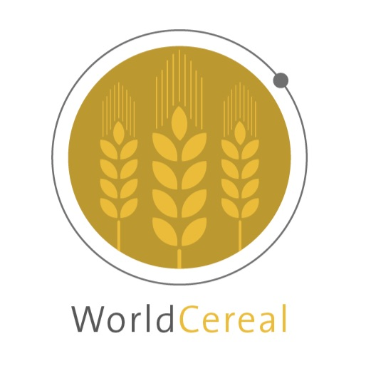

# WorldCereal classification module
[](https://github.com/WorldCereal/worldcereal-classification/actions/workflows/ci.yaml) [](https://zenodo.org/badge/latestdoi/621251443) [](https://your-terrascope-url)


<div style="text-align: center;">
  <a href="https://esa-worldcereal.org/en" target="_blank">
    
  </a>
</div>

## Overview

**WorldCereal** is a Python package designed for generating cropland and crop type maps at a wide range of spatial scales, leveraging satellite and auxiliary data, and state-of-the-art classification workflows. It uses [openEO](https://openeo.org/) to run classification tasks in the cloud, by default the [Copernicus Data Space Ecosystem (CDSE)](https://dataspace.copernicus.eu/). 

Users can leverage the system in a notebook environment through [Terrascope](https://your-terrascope-url) or set up the environment locally using the provided installation options.

In order to run classification jobs on CDSE, users can get started with **monthly free processing credits** by registering on the CDSE platform. Additional credits can be purchased, or users may soon be able to request them through the **ESA Network of Resources**.

---

## Features

- **Scalable**: Generate maps at a wide range of spatial scales.
- **Cloud-based Processing**: Leverages openEO to run classifications in the cloud.
- **Customizable**: Users can pick any region or temporal range and apply either default models or train their own and produce custom maps.
- **Easy to Use**: Integrates into Jupyter notebooks and other Python environments.

## Quick Start

#### Option 1: Run on Terrascope

You can use a preconfigured environment on [**Terrascope**](https://terrascope.be/en) to run the workflows in a Jupyter notebook environment.

[Run WorldCereal on Terrascope](https://your-terrascope-url)

#### Option 2: Install Locally

If you prefer to install the package locally, you can create the environment using **Conda** or **pip**.

##### Conda Installation

To create the Conda environment:

1. Clone the repository:
   ```bash
   git clone https://github.com/WorldCereal/worldcereal-classification.git
   cd worldcereal-classification

2. Create the environment using the provided environment file:
    ```
    conda env create -f environment.yml
    conda activate worldcereal
    ```
Installation instructions:
For Conda: `conda env create -f environment.yml`
For Pip: `pip install .`

Launch the _beta_ version of a V1 version of the new system:

[](https://replay.notebooks.egi.eu/v2/gh/WorldCereal/worldcereal-binder/main?urlpath=git-pull%3Frepo%3Dhttps%253A%252F%252Fgithub.com%252FWorldCereal%252Fworldcereal-classification%26urlpath%3Dlab%252Ftree%252Fworldcereal-classification%252Fnotebooks%252Fsystem_v1_demo.ipynb%26branch%3Dsystem-v1-demo)


*Van Tricht, K., Degerickx, J., Gilliams, S., Zanaga, D., Battude, M., Grosu, A., Brombacher, J., Lesiv, M., Bayas, J. C. L., Karanam, S., Fritz, S., Becker-Reshef, I., Franch, B., Mollà-Bononad, B., Boogaard, H., Pratihast, A. K., & Szantoi, Z. (2023). WorldCereal: A dynamic open-source system for global-scale, seasonal, and reproducible crop and irrigation mapping. Earth System Science Data Discussions, 1–36. https://doi.org/10.5194/essd-2023-184*
